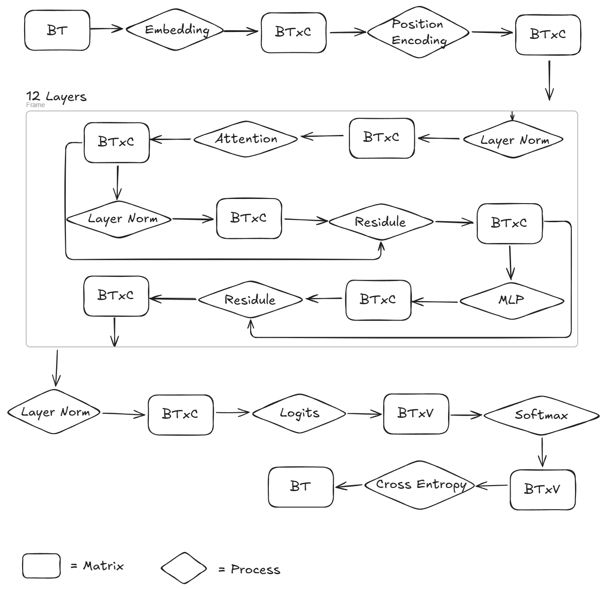

:::note
WIP, it will be a cross post
:::

# CUPTI Introduction
CUPTI is a profiling and tracing api that exposes the hardware counters of NVIDIA GPUs, collects CUDA runtime information and enables developers to build custom profilers. If you used Nsight Compute or Nsight System before, you won't be unfamiliar with it, because they are built on top of CUPTI, which means you can built whatever Nsight Compute or Nsight System implemented, plus extra features you would like to have.

The data shown in this blog is collected via CUPTI Activity API and Range Profiling API. For more details about CUPTI, please refer to *xxx_link*

# llm.cpp Introduction
In this blog, we will profile [llm.cpp](https://github.com/zhangpiu/llm.cpp) as an entry-level example of LLM profiling. llm.cpp is a C++ re-implementation of [llm.c](https://github.com/karpathy/llm.c), reproducing the GPT-2 model from OpenAI. It uses a C++ template-only library, Eigen, to do matrix multiplication and computational optimization, which also increases the runtime performance by avoiding the dynamic linkage.

By default, llm.cpp will load the training data in B=4 sequences each batch, T=64 tokens per sequence in each training step. Each token will have C=768 embeddings. It will do 40 steps of training, each of which will have a forward pass to calculate the loss, i.e. softmax cross entropy, and a backward pass to calculate gradients and update weights using an Adam Optimizer.

Here is the big picture of the forward process of llm.cpp:

The input of each training step is a vector of B*T tokens. In the embedding, each token is mapped to an embedding of size C(i.e. 768 floats by default), making the output matrix to be [BT, C]. An position encoding offsets are then applied to each token, which is only related to the position of token within the sequence. After this, 12 blocks of same operations are done to the encoded tokens. Other than the straightforward normalization, addition of residual, and a Feedforward network, each block go through a multi-head attention layer, which calculates the corelation between tokens in each sequence and keeps this infomation in the output of attention layer. Finally, after all these 12 blocks, a  
