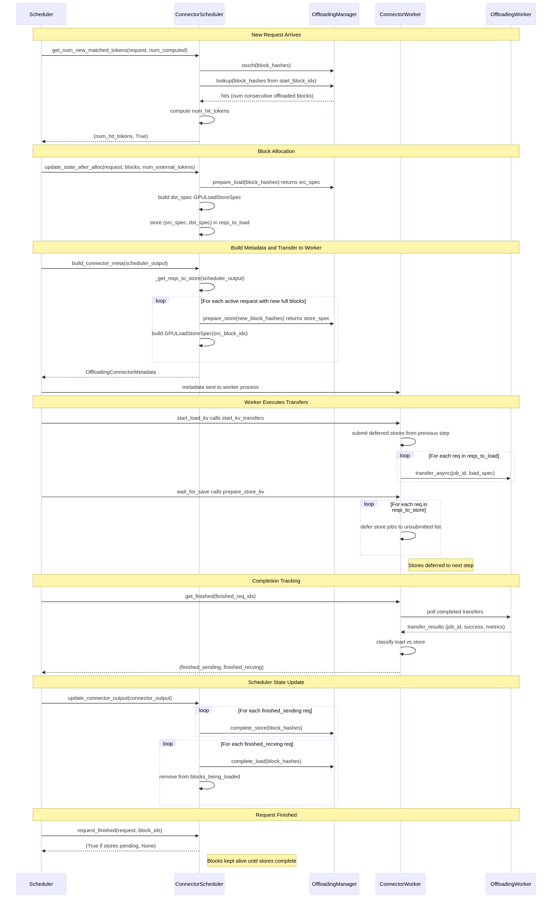
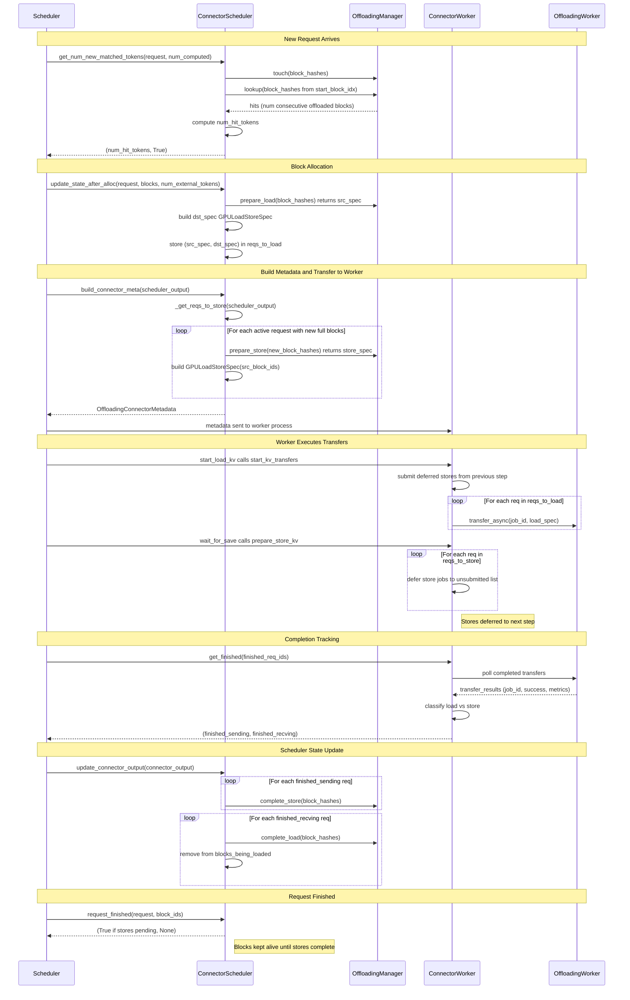

# OffloadingConnector Documentation

## How the OffloadingConnector Works

The `OffloadingConnector` is a KV cache connector that **offloads KV cache blocks from GPU memory to another medium** (e.g., CPU memory or disk) and loads them back when needed. This enables prefix caching across a larger capacity than GPU memory alone.

### Architecture: Scheduler + Worker Split

The connector follows a **two-role pattern** — it instantiates different internal components depending on its role:

- **`OffloadingConnectorScheduler`** (runs in the scheduler process): Decides *what* to load/store and *when*, by consulting an `OffloadingManager` that tracks which blocks exist in offloaded storage.
- **`OffloadingConnectorWorker`** (runs in the worker/GPU process): Executes the actual async data transfers via an `OffloadingWorker`.

### Key Flow

#### 1. Matching offloaded tokens (scheduler-side)

When a new request arrives, `get_num_new_matched_tokens()` checks if any of the request's prefix blocks already exist in offloaded storage:

- It computes block hashes for the request's tokens.
- Calls `self.manager.lookup()` to see how many consecutive blocks are offloaded.
- Returns the number of tokens that can be **loaded from offloaded storage** instead of recomputed, enabling prefix cache hits beyond GPU memory.
- If blocks are currently being loaded by another request (tracked via `_blocks_being_loaded`), it returns `None` to defer scheduling.

#### 2. Preparing loads (scheduler-side)

`update_state_after_alloc()` is called after GPU blocks are allocated for external (offloaded) tokens:

- It calls `self.manager.prepare_load()` to get a **source spec** describing where the data lives in offloaded storage.
- It builds a **destination spec** (`GPULoadStoreSpec`) with the newly allocated GPU block IDs.
- The `(src_spec, dst_spec)` pair is stored in `_reqs_to_load` for the worker to execute.

#### 3. Preparing stores (scheduler-side)

`_get_reqs_to_store()` runs during `build_connector_meta()`:

- For each active request, it checks if new full blocks (of `offloaded_block_size`) have been computed since the last store.
- Calls `self.manager.prepare_store()` to get the destination spec and set of block hashes that actually need storing (deduplicating already-offloaded blocks).
- Builds a `GPULoadStoreSpec` source from the corresponding GPU block IDs.

#### 4. Executing transfers (worker-side)

- **Loads**: `start_kv_transfers()` submits load jobs via `self.worker.transfer_async()` at the start of each forward pass.
- **Stores**: `prepare_store_kv()` registers store jobs but **defers submission** to the next engine step's `start_kv_transfers()` call. This ensures offloading happens *after* token sampling, avoiding delays to generation latency.

#### 5. Completion tracking (worker-side)

`get_finished()` polls the worker for completed transfers and returns two sets:

- **`finished_sending`**: Requests whose store (offload) jobs are all done — their GPU blocks can now be freed.
- **`finished_recving`**: Requests whose load jobs are done — the KV data is now in GPU memory and the request can proceed with inference.

If a request finishes generating while stores are still in progress, it's placed in `_finished_reqs_waiting_for_store` and only reported as finished once all store jobs complete (preventing premature block freeing).

#### 6. Event reporting

`take_events()` yields `BlockStored`/`BlockRemoved` events from the manager, which feed into the external KV cache event system.

### Block Size Mapping

The offloaded block size can differ from the GPU block size (typically larger). The `block_size_factor = offloaded_block_size // gpu_block_size` maps between them — one offloaded block corresponds to multiple contiguous GPU blocks. Block hashes are sampled at offloaded-block granularity from the request's fine-grained block hash list.

### Metrics

`OffloadingConnectorStats` and `OffloadPromMetrics` track transfer sizes and times per transfer type (e.g., `gpu_to_cpu`, `cpu_to_gpu`), exposed as Prometheus counters and histograms.

---

## Scheduler - OffloadingConnector Communication Flow

The following sequence diagram illustrates the full communication lifecycle between the Scheduler, ConnectorScheduler, OffloadingManager, ConnectorWorker, and OffloadingWorker.

<!-- Mermaid source (for editors that support it):

-->

### Diagram Summary

| Phase | Key Interaction | Purpose |
|-------|----------------|---------|
| **Request Matching** | Scheduler → ConnectorScheduler → Manager | Determine how many prefix tokens exist in offloaded storage |
| **Block Allocation** | Scheduler → ConnectorScheduler → Manager | Prepare load transfer specs (offloaded → GPU) |
| **Metadata Handoff** | ConnectorScheduler → Scheduler → Worker | Package load + store specs into `OffloadingConnectorMetadata` |
| **Transfer Execution** | Worker → OffloadingWorker | Submit loads immediately; defer stores to next step |
| **Completion Tracking** | Worker → OffloadingWorker → Scheduler | Poll finished jobs, report `finished_sending` / `finished_recving` |
| **State Reconciliation** | Scheduler → ConnectorScheduler → Manager | Finalize stores/loads, update `_blocks_being_loaded` |
| **Request Finished** | Scheduler → ConnectorScheduler | Hold GPU blocks if stores still in-flight |
