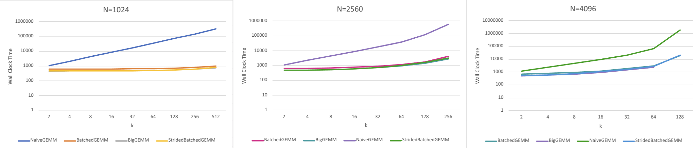
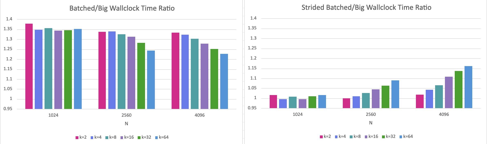
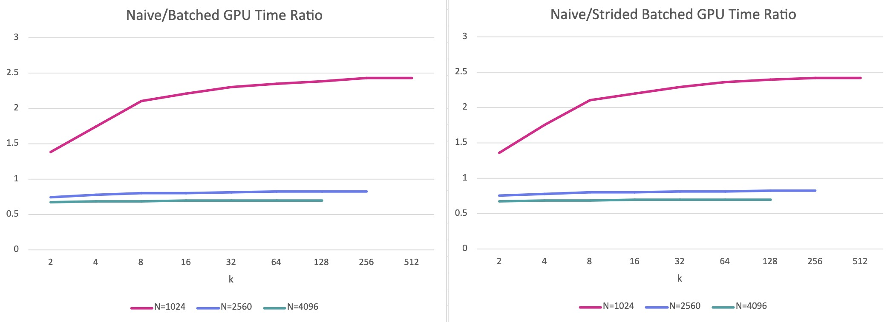
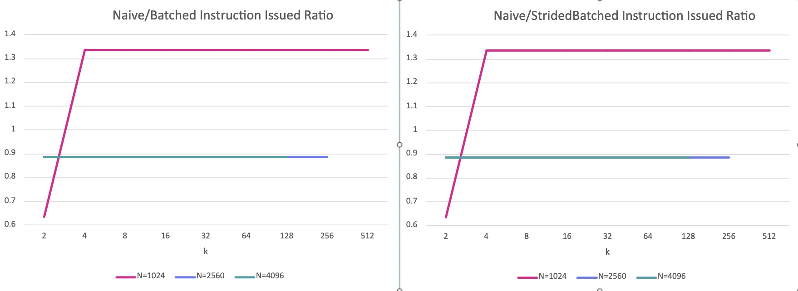
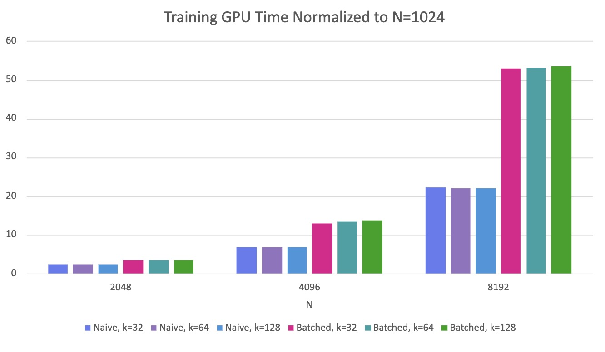
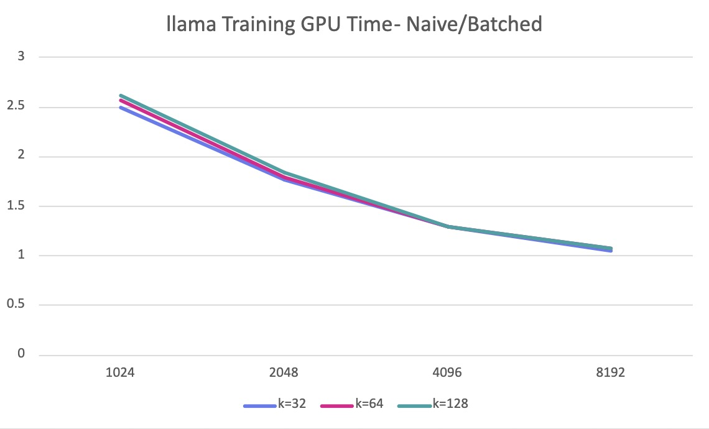
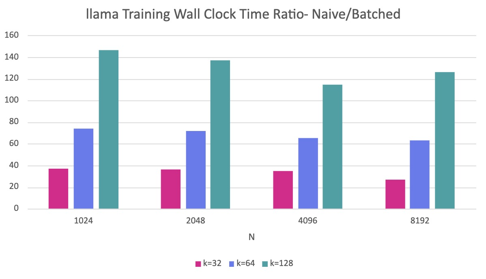
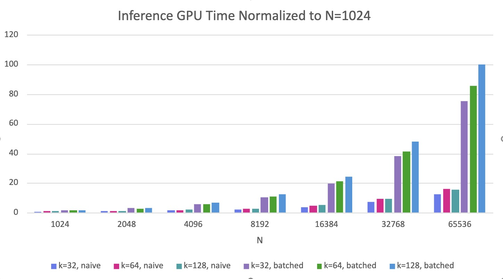
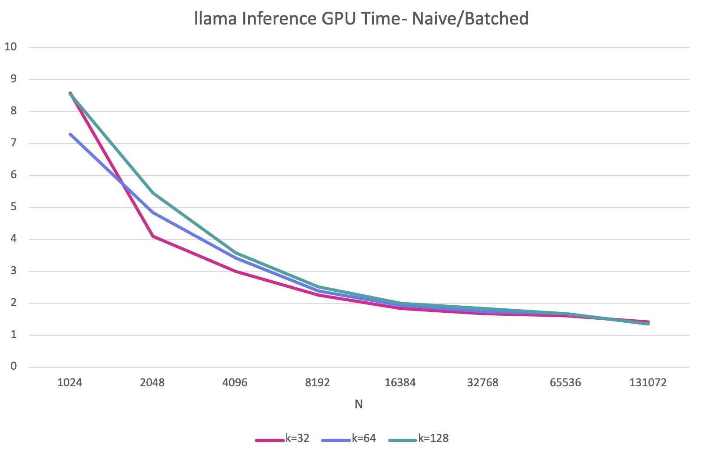

:::warning
Under Construction!
:::

# Introduction
Attention layer is among the most time-consuming part of any LLM. It consists of multiple matrix multiplications that are theoretically bottlenecked by tensor core throughput according to the roofline model from this post[link]. However, our result reveals that the memory throughput instead is constraining the performance of the attention layer. This discrepancy between theory and reality leads to this post. 

GEMM(i.e. General Matrix Multiplication) is always one of the hottest topic in HPC. The transformer architecture made this even more stark: every attention layer, every feed-forward block, every projection is fundamentally a GEMM, therefore even small amount of improvement on GEMM can cause huge impact on overall system performance. With the increasing problem size, the performance usually starts to be limited by either the memory throughput or compute resources. Through this post, I will introduce the GEMM performance of various matrix size, shape and batch size, revealing the bottleneck in different conditions. The attention layer GEMM performance of the popular open-source model, llama3, will also be provided for practical analysis.   

# Setup
We will profile 4 ways of computing GEMM using cuBLAS. To compare apples to apples, it is ensured that every cuBLAS GEMM perform the same amount of FLOPs with FP32 and running on the same device, which is an A100 (40GB, SXM4).

## Single Big GEMM
This is simply calling *cublasSgemm* with wider matrix compared to other methods. This is expected to perform at least no worse than other metrics because:

* More opportunities to reuse the memory.
* More algorithms available for larger matrices.
* Less padding needed for tiling compared to smaller GEMMs.
* Less kernels invoked.

Therefore the single big GEMM is considered as a upper bound on Performance among all the methods.

## Naive GEMM
Given many small matrix multiplications, we have two ways of distributing the work to GPU: either launching one kernel for each matrix multiplications or fusing the kernels into one or several mega-kernels. The so called Naive GEMM refers to the first approach, by continuously launching per-multiplication small kernels in a for-loop. Here is a piece of sample code: 

```cpp
for (int i = 0; i < batch_size; i++) {
    CHECK_CUBLAS(cublasSgemm(handle, CUBLAS_OP_N, CUBLAS_OP_N,
                            m, n, k_dim,
                            &alpha,
                            d_A_array[i], m,
                            d_B_array[i], k_dim,
                            &beta,
                            d_C_array[i], m));
}
```

## Batched GEMM
As mentioned before, the second approach for many small matrix multiplications is batching. The Batched GEMM allows you to perform multiple independent matrix multiplications in a single or small amount of kernel launches, which are supposed to be much more efficient than launching separate GEMM operations. To batch the GEMM, we simply prepare the input matrices as array of pointers and call the corresponding CUBLASS API:

```cpp
// Allocating DEVICE matrices and store the pointers in HOST vectors
std::vector<float*> d_A_array(batch_size), d_B_array(batch_size), d_C_array(batch_size);
for (int i = 0; i < batch_size; i++) {
    if (cudaMalloc(&d_A_array[i], size_A) != cudaSuccess ||
        cudaMalloc(&d_B_array[i], size_B) != cudaSuccess ||
        cudaMalloc(&d_C_array[i], size_C) != cudaSuccess) {
        printf("CUDA malloc failed for Batched Gemm");
        for (int j = 0; j <= i; j++) {
            if (d_A_array[j]) cudaFree(d_A_array[j]);
            if (d_B_array[j]) cudaFree(d_B_array[j]);
            if (d_C_array[j]) cudaFree(d_C_array[j]);
        }
        return false;
    }
}

// Allocating DEVICE vectors to store DEVICE pointers to arrays 
float **d_A_ptr, **d_B_ptr, **d_C_ptr;
if (cudaMalloc(&d_A_ptr, batch_size * sizeof(float*)) != cudaSuccess ||
    cudaMalloc(&d_B_ptr, batch_size * sizeof(float*)) != cudaSuccess ||
    cudaMalloc(&d_C_ptr, batch_size * sizeof(float*)) != cudaSuccess) {
    printf("CUDA malloc failed for pointer arrays in testBatchedGemm - skipping test\n");
    for (int i = 0; i < batch_size; i++) {
        cudaFree(d_A_array[i]);
        cudaFree(d_B_array[i]);
        cudaFree(d_C_array[i]);
    }
    return false;
}

// Copy pointers from HOST to DEVICE
CHECK_CUDA(cudaMemcpy(d_A_ptr, d_A_array.data(), batch_size * sizeof(float*), cudaMemcpyHostToDevice));
CHECK_CUDA(cudaMemcpy(d_B_ptr, d_B_array.data(), batch_size * sizeof(float*), cudaMemcpyHostToDevice));
CHECK_CUDA(cudaMemcpy(d_C_ptr, d_C_array.data(), batch_size * sizeof(float*), cudaMemcpyHostToDevice));

CHECK_CUBLAS(cublasSgemmBatched(handle,
                                CUBLAS_OP_N, CUBLAS_OP_N,
                                m, n, k_dim,
                                &alpha,
                                (const float**)d_A_ptr, m,
                                (const float**)d_B_ptr, k_dim,
                                &beta,
                                d_C_ptr, m,
                                batch_size));
```

## Strided Batched GEMM
Similar to Batched GEMM, cuBLAS provides another way to batch small GEMMs. The essential difference of the two batched GEMM are the memory layout of the input matrices. Batched GEMM stores the matrices separately, whereas Strided Batched GEMM utilizes a contiguous piece memory to store each matrix. Instead of accepting pointer arrays to matrices, Strided Batched GEMM receives the base device pointers of matrices along with the stride, which are used to compute the address of sub-matrices.

The benefit of this method is clear: for array-of-pointer solution, it needs to first read the pointer, and then read the data from the memory. However, only one read is needed for the pointer-with-stride option because the pointer is calculated through the base pointer, batch id and stride.

Here is the sample code:
```cpp

// Pointers to matrices on the DEVICE
float *d_A, *d_B, *d_C;

// Allocate DEVICE memory
if (cudaMalloc(&d_A, total_size_A) != cudaSuccess ||
    cudaMalloc(&d_B, total_size_B) != cudaSuccess ||
    cudaMalloc(&d_C, total_size_C) != cudaSuccess) {
    printf("CUDA malloc failed in testStridedBatchedGemm - skipping test\n");
    if (d_A) cudaFree(d_A);
    if (d_B) cudaFree(d_B);
    if (d_C) cudaFree(d_C);
    return false;
}

CHECK_CUBLAS(cublasSgemmStridedBatched(handle,
                                        CUBLAS_OP_N, CUBLAS_OP_N,
                                        m, n, k_dim,
                                        &alpha,
                                        d_A, m, stride_A,
                                        d_B, k_dim, stride_B,
                                        &beta,
                                        d_C, m, stride_C,
                                        batch_size));
```
# $k$ batches of $(N \times N) \times (N \times N)$
We begin with square matrix multiplications, the simplest and most symmetric case. In batched methods, we perform k independent multiplications of $(N \times N) \times (N \times N)$. To ensure fair comparison across all four methods, we configure each to perform identical total FLOPs:

| Method | Configuration | Total FLOPs |
|--------|---------------|-------------|
| Single Big GEMM | $(N \times N) \times (N \times kN)$ | $2kN^3$ |
| Naive GEMM | $k$ iterations of $(N \times N) \times (N \times N)$ | $2kN^3$ |
| Batched GEMM | $k$ batched $(N \times N) \times (N \times N)$ | $2kN^3$ |
| Strided Batched GEMM | $k$ batched $(N \times N) \times (N \times N)$ | $2kN^3$ |

The A100's 40 MB L2 cache plays a critical role in GEMM performance. When working sets fit in L2, data can be reused across thread blocks without expensive memory accesses. We select three values of $N$ to test different cache behaviours:

| $N$ | Per-Batch Size($A+B+C$) | Ratio to L2 (40 MB) | Expected Behavior |
|-----|---------------------------------------------|---------------------|-------------------|
| 1024 | 12 MB | ~0.3× | Fits comfortably; high L2 hit rate |
| 2560 | 75 MB | ~1.9× | Exceeds L2; partial eviction |
| 4096 | 192 MB | ~4.8× | Far exceeds L2; streaming from memory |

For each $N$, we increase $k$ from 2 until running out of GPU memory, observing how each method scales.



The overall wallclock time is shown in the above plot, with y axis presented at logarithmic scale. It clearly reveals that among different N, Naive GEMM always perform far worse than other three methods, and the performance gap scales with the k respectively. This matches our expectation because Naive GEMM launches $k$ kernels in the loops and therefore kernel overhead accumulates and finally dominates the wallclock time as $k$ increases.



We further compare the other three techniques by calculating the time ratio with Single Big GEMM as the baseline, which achieves the lowest wallclock time among all techniques. Overall, Strided GEMM performs better than Batched GEMM, with average wallclock time increases of $5\%$ and $32\%$ over Single Big GEMM respectively. However, the most notable observation is that the performance advantage of Strided GEMM and Single Big GEMM diminishes as $N$ increases. This phenomenon becomes most pronounced with larger $k$. For example, when $k=2$, the overhead of Batched GEMM only decreases by $4\%$ (from $37\%$ to $33\%$), and Strided Batched GEMM remains nearly constant as $N$ increases. In contrast, when $k=64$, Batched GEMM overhead drops significantly from $35\%$ to $22\%$, while the overhead of Strided Batched GEMM increases sharply from $1\%$ to $16\%$. 



Next we will take a more nuanced look at the GPU execution time. Since GPU execution time excludes kernel launch overhead, the accumulated GPU time of Naive GEMM becomes comparable to the other three methods. The plot above displays the GPU time ratio between Naive GEMM and the two batched techniques. A higher ratio indicates worse Naive GEMM performance relative to the respective methods. This plot reveals two distinct trends: with smaller $N=1024$, both Batched GEMM and Strided Batched GEMM perform approximately 1.5×–2.5× better than Naive GEMM. However, with larger $N=2560$ and $N=4096$, Naive GEMM consistently outperforms the other two methods.



Here we provide the ratio of total SASS instructions issued by the SMSP. It reveals a similar pattern to the GPU time: when $N=1024$, Naive GEMM issues more SASS instructions, whereas when $N=2560$ and $N=4096$, Naive GEMM issues less. This indicates that cuBLAS likely selects different algorithms or memory strategies for different values of $N$ heuristically, with a transition point occurring between $N=1024$ and $N=2560$. From $N=2560$ to $N=4096$, the instruction ratio of Batched GEMM and Strided Batched GEMM both reaches ~0.9, implying that they are using the same algorithm under the hood when L2 can't store any of the matrix. 

# Practical Workload - llama 3.1
To contextualize our analysis within realistic scenarios, we evaluate GEMM scaling performance across the attention mechanism ($QK^T$) of llama3.1-8B, llama3.1-70B, and llama3.1-405B variants.

## Arithmetic Intensity Analysis
Arithmetic Intensity (AI) quantifies the computational density, more specifically, FLOPs per byte. High AI signifies compute-bound kernels where computation dominates, whereas low AI indicates memory-bound kernels where data movement constrains performance. This metric is essential for understanding the kernel behavior, therefore we will provide AI for both training and inference phases before going into full details.

The matrix dimensions and attention head configuration are enumerated below for both Training and Inference:

**Training**
| Model | NumHeads (H) | Hidden Dimension (C) | Per Head Q | Per Head K |
|-------|--------------:|---------------------:|------------|------------|
| Llama3.1-8B   | 32  | 4096  | [T x 128] | [T x 128] |
| Llama3.1-70B  | 64  | 8192  | [T x 128] | [T x 128] |
| Llama3.1-405B | 128 | 16384 | [T x 128] | [T x 128] |

**Inference**
| Model | NumHeads (H) | Hidden Dimension (C) | Per Head Q | Per Head K |
|-------|--------------:|---------------------:|------------|------------|
| Llama3.1-8B   | 32  | 4096  | [1 x 128] | [T x 128] |
| Llama3.1-70B  | 64  | 8192  | [1 x 128] | [T x 128] |
| Llama3.1-405B | 128 | 16384 | [1 x 128] | [T x 128] |

Derived from the $Q$ and $K$ dimensions, the Arithmetic Intensity formulations are:

| Phase | Operation | AI Formula |
|-------|-----------|------------|
| Training | `[T×128] × [128×T] → [T×T]` | $\frac{128T}{256+T}$ |
| Inference | `[1×128] × [128×T] → [1×T]` | $\frac{128T}{128+129T}$ |

The computed AI values across varying T are tabulated below:

| Sequence Length (T) | Training AI (FLOP/Byte) | Inference AI (FLOP/Byte) |
|--------------------:|---------------:|-----------------:|
| 1024 | 102.4 | 0.991 |
| 2048 | 113.8 | 0.992 |
| 4096 | 120.5 | 0.992 |
| 8192 | 124.1 | 0.992 |
| 16384 | 126.0 | 0.992 |
| 32768 | 127.0 | 0.992 |
| 65536 | 127.5 | 0.992 |
| 131072 | 127.8 | 0.992 |

 It is noteworthy that the AI of Inference reaches merely ~0.992, representing over 100× lower density than its training counterpart. As T scales, both training and inference AI converge toward 128 and 0.992 respectively. These metrics demonstrate that theotically, inference operates under severe memory bandwidth constraints, with computational resources substantially underutilized.

## Training
We collected the training GPU execution time and normalized the values with the corresponding $N=1024$ value. Since the Batched GEMM and Strided Batched GEMM have similar results, we will only show the Batched GEMM in the plot for simplicity.





The GPU execution time scales significantly with $N$, but barely changes among different $k$. The Batched GEMM and Strided Batched GEMM scales much higher than the Naive GEMM, with around 3.3x, 13x and 53x of the $N=1024$ value, compared to the Naive GEMM's $2.4x, 6.7x and 22x$ to the corresponding $N=1024$ value. However, it doesn't mean that Naive GEMM is more efficent than Batched GEMM. We further provide the time ratio between Naive GEMM and Batched GEMM. When $N=1024$, the Naive GEMM constantly takes ~2.5x more time compared toi the Batched GEMM with all $k$. As $N$ scales, the gap between the two techniques narrows, and at $N=8192$, both methods produce similar performance.



Despite of the advantage of GPU time on small $N$, the performance of Naive GEMM drastically dropped if taking launch overhead into account. It is about 35x to 147x slower than the Batched GEMM with varying $k$, which is as expected because as $k$ scales, the number of kernel launched will increase proportionally, accumulating the launch overhead.

## Inference





In inference, similar trend still persists. The GPU execution time scales with $N$, but the speed slows down. For example, in inference, the Batched GEMM with $k=32$ only takes 1.8x, 3x and 5.6x of GPU time spent by $N=1024$ for $N=2048, 4096, 8192$ respectively, whereas the in training, the numbers increases to 3.3x, 13x and 53x with same $N$ and $k$, probably because of the smaller dimension of $Q$(from $T \times 128$ to $1 \times 128$) in inference causing less pressure on memory traffic. Similarly, the Batched GEMM also spends more GPU time compared to the Naive GEMM, but the initial gap at small $N$ enlarges. When $N=1024$, the Naive GEMM spent 7.3x~8.6x more time relative to the Batched GEMM in inference. However, this figure is only 2.5x in training. As $N$ keep increasing, the gap between two techniques still shrinks to 0, but in inference, the changing rate slows down.


