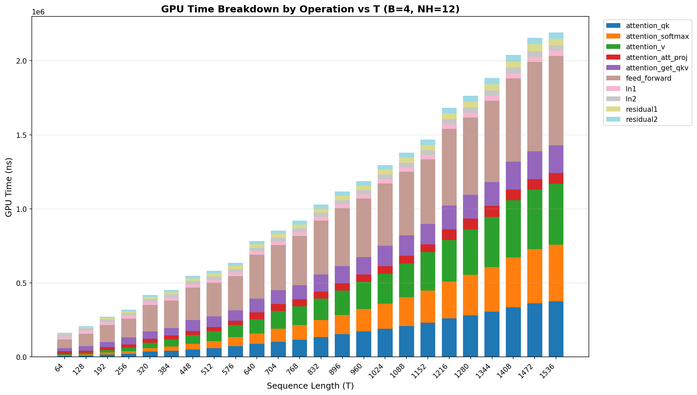
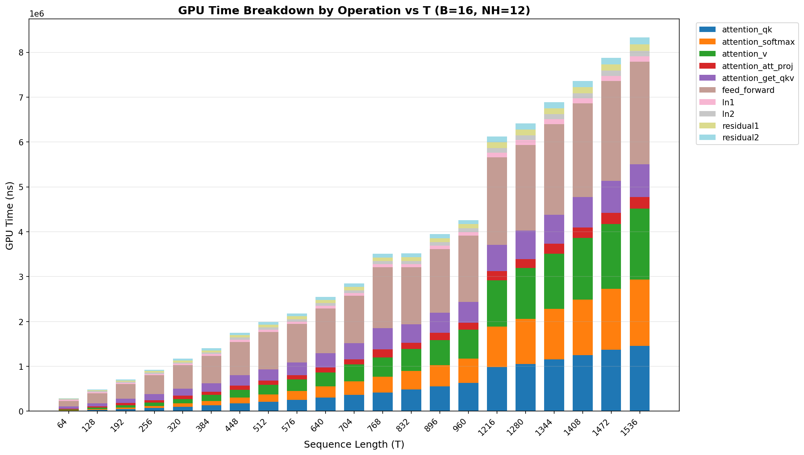
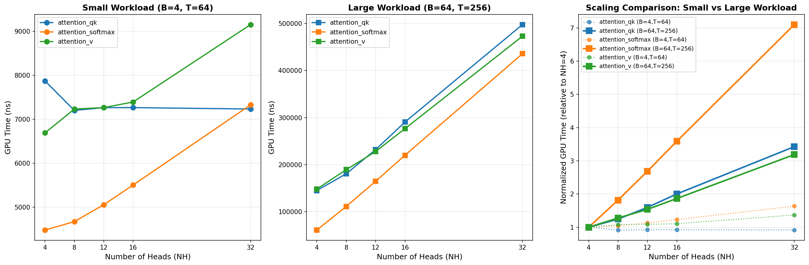
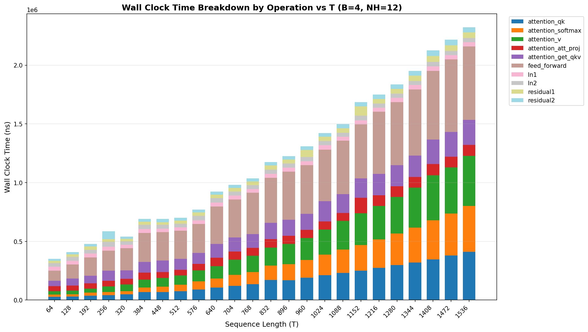
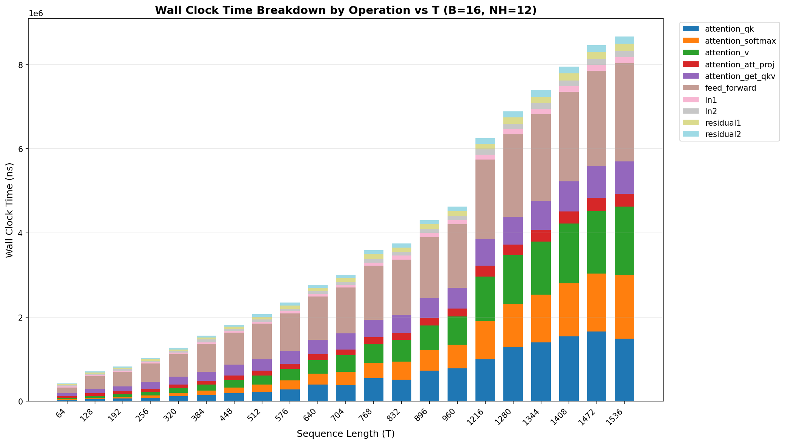
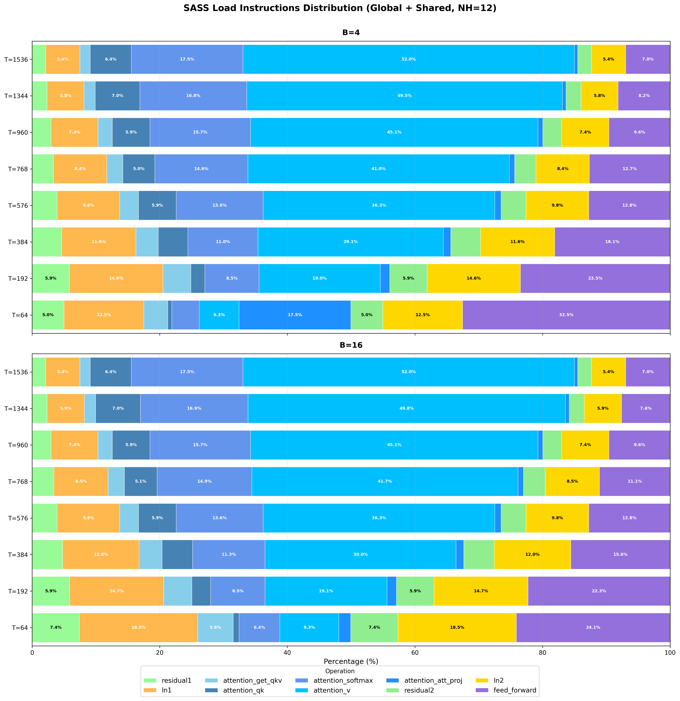
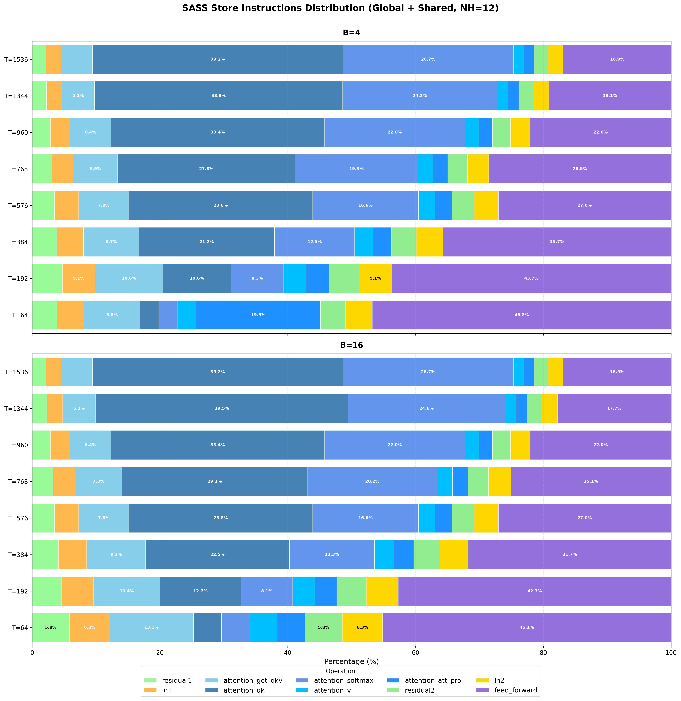
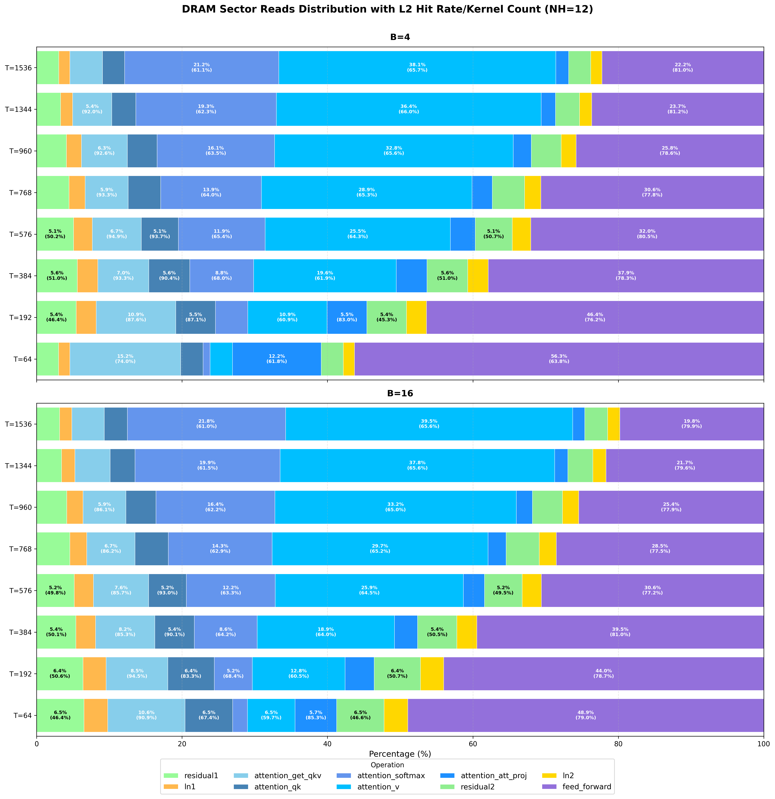
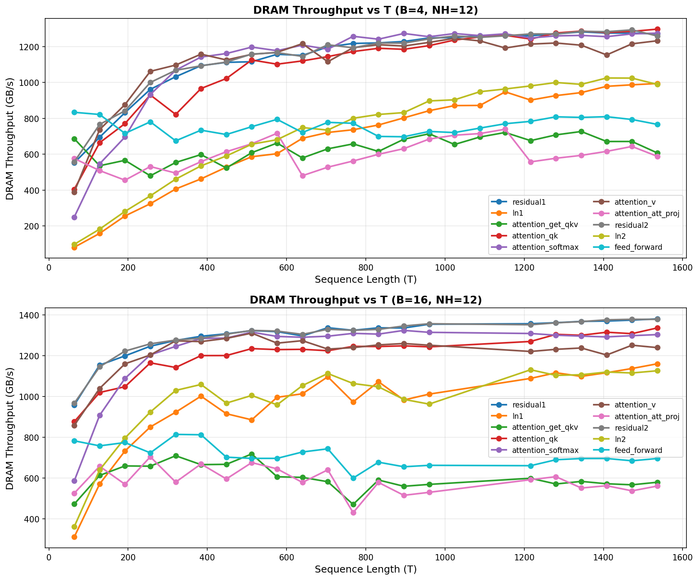

# Introduction
In the previous post(link), we analyzed the performance characteristics of individual ranges within a single GPT-2 layer. Building on that foundation, this post examines how transformer performance scales along three critical dimensions: batch size (B), context length (T), and number of attention heads (NH). 

Understanding these scaling behaviors is crucial for optimizing LLM Performance, as each dimension affects computational complexity and memory requirements differently. For instance, context length has a quadratic impact on attention ($O(T^2)$), while batch size typically scales linearly. We will identify performance bottlenecks for each component and validate our findings against the theoretical roofline model established in the previous post.

# Setup
We profile the second layer of the transformer, decomposing it into multiple blocks for detailed performance analysis. For each block, we vary three parameters:

| Parameter | Description| Values |
|-----------|------------|--------|
| B | Batch size | 4, 16 |
| T | Context length | 64 to 1536 (interval of 64) |
| NH | Number of attention heads | 4, 8, 12, 16, 32 |

Unless explicitly stated, we use NH=12 by default.

Due to dataset constraints, only a subset of (B, T) combinations can be evaluated, with fewer context lengths available at higher batch sizes. Increasing B further would limit testing to only a handful of T values, providing insufficient data points for robust comparison with B=4 and B=16. Therefore, we restrict our analysis to two batch sizes to ensure comprehensive coverage across the context length dimension.  

# GPU Time
## Varing T

We first look at the GPU execution time. They are displayed in the distribution plot above, scaling with T. With $T=64$, feed_forward and attention(accumulated from all the sub-ranges) dominate the GPU usage, collectively takes 72.4% in $B=4$ and 78.8% in $B=16$. This dominance persist when T increases in both scanrioes. The distribution of attention and feed_forward raise to 92.4% and 93.5% respectively with T increase to ~1.5k. This behaviour suggests that when improving the performance of transformer, probably we should pinpoint on the attention and feed_forward to maxmimize the overall system performance improvement.

Further focusing on the attention and feed_forward by deviding the attention into multiple stages, we can find that attention_qk, attention_softmax and attention_v scale much faster than other attention ranges and feed_forward. Collectively they raised from 12.2% to 52.4% of the total GPU time with $B=4$ and from 12.1% to 54.3% of the total GPU time with $B=16$. Individually, they raised from 4.4%, 3.2% and 4.5% to 16.8%, 16.9%, 18.5% with $B=4$ and from 4.4%, 3.1% and 4.5% to 17.5%, 17.8%, 19% with $B=16$. In contrast, feed_forward shirnks significantly from 36.2% to 28% and 43.5% to 27.4% on $B=4$ and $B=16$.

The reason for the distribution shift lies on the characteristics of these ranges. Here is a summary table of roofline analysis from the previous post:

| SUB BLOCKS | NUM ELEMENTS ACTIVATION | Total OPs | Bound |
|------------|--------------|-----------|-------|
|Q, K, V | $B * T * 3C$ |$6 * B * T * C^2$| Compute |
|SoftMAX($QK^T$) | $B * NH * T^2$ | $2 * B * T^2 * C + 3 * B * NH * T^2$| QK Compute, Softmax Memory|
|V Matmul | x | $2 * B * T^2 * C$|  Compute |
|O | $B * T * C$ | $2 * B * T * C^2$| Compute |
|MLP1 | $B * T * 4C$ | $8 * B * T * C^2$| Compute |
|MLP2 | $B * T * C$ |  $8 * B * T * C^2$| Compute |

Most of the mentioned time-consuming ranges are compute-bound and the total FLOPS scales quadratically with T, indicating the GPU time should be $O(T^2)$. The only memory-bound range, attention_softmax, still has $T^2$ activations to write to, meaning that in theory, the GPU time of attention_softmax should still be $O(T^2)$. This is why we see similar growth on attention_qk, attention_softmax and attention_v. On the other hand, layer norm and residual block are memory-bound, and their activations and the input matrices only scales linearly with $T$, leading to $O(n)$ GPU time. 

## Varing NH

The chart above illustrates GPU time scaling with respect to NH. Except for attention_qk at $B=4$ and $T=64$, all ranges exhibit linear scaling with NH. The anomalous behavior of attention_qk under small B and T conditions stems from severe GPU underutilization due to insufficient parallelism. The log reveals the following kernel launch configurations:

| NH | Grid Configuration | Block Configuration |
|----|-------------------|---------------------|
| 4  | <<<1, 1, 16>>>   | <<<128, 1, 1>>>    |
| 8  | <<<1, 1, 32>>>   | <<<128, 1, 1>>>    |
| 12 | <<<1, 1, 48>>>   | <<<128, 1, 1>>>    |
| 16 | <<<1, 1, 64>>>   | <<<128, 1, 1>>>    |
| 32 | <<<1, 1, 128>>>  | <<<128, 1, 1>>>    |

Given A100's 108 SM and 64 Warps per SM in maximum, obviously the GPU is heavily underutilized, so increasing NH only raises the amount of threads executed concurrently on GPU, but doesn't increase the GPU time.

# Wall Clock Time

The wall clock time distribution mirrors the GPU execution time trend: attention_qk, attention_softmax, attention_v, and feed_forward continue to dominate due to their $O(T^2)$ computational and memory access patterns. 

An interesting observation is that feed_forward consumes relatively less wall clock time at small B and T values, despite launching more kernels than other ranges—each launch incurring tens of microseconds of overhead. At $B=4$, $T=64$, the feed_forward wall clock time drops from 36.2% (GPU time) to 24.3% (wall clock time); at $B=16$, $T=64$, it drops from 43.5% to 31.8%. However, this discrepancy diminishes as T increases, with the two metrics converging at larger context lengths.

# SASS Instruction

Next, we provide the sass instructions along with the DRAM accesses distributions among all ranges. Since some ranges only use shared memory and others use global memory, we aggregate the shared and global memroy for loads and stores respectively to measure the total amount of requests. The L2 hit rate is given within the parenthesis next to the DRAM access distribution. 

The results reveal that SASS store requests scale most dramatically for attention_qk and attention_softmax, while attention_softmax and attention_v exhibit the most significant scaling for SASS loads. These three ranges execute sequentially—attention_qk → attention_softmax → attention_v—revealing a natural producer-consumer pattern: store operations from one range generate corresponding loads in the subsequent range, as each stage's output becomes the next stage's input. 

Since attention_qk produces a $T \times T$ matrix, its store requests scale quadratically with T, i.e., $O(T^2)$. Consequently, attention_softmax loads exhibit identical quadratic scaling. This same pattern applies to attention_softmax outputs feeding into attention_v. In contrast, other ranges produce matrices containing only $O(T)$ or $O(1)$ elements, explaining the rapid transition from feed_forward dominance at $T=64$ to attention dominance at $T=1536$ in both load and store distributions.

# DRAM Accesses

In terms of DRAM accesses, a similar pattern emerges. The three attention sub-blocks - attention_qk, attention_softmax, and attention_v - account for a substantial portion of DRAM traffic. Specifically, attention_qk and attention_softmax dominate write operations, while attention_softmax and attention_v dominate read operations. The L2 hit rate is provided in the parenthesis in case you are interested.

The DRAM throughput is displayed in the chart above, confirming our roofline model predictions. In both $B=4$ and $B=16$ scenarios, feed_forward, attention_get_qkv, and attention_att_proj utilize approximately 700-800 GB/s DRAM bandwidth, significantly below the 1600 GB/s peak DRAM throughput. In contrast, other ranges either reach near-peak performance (~1.4 TB/s) or exhibit an upward trend toward the peak. According to our analysis, these three lower-bandwidth ranges are compute-bound. 

Notably, although attention_qk and attention_softmax are classified as compute-bound in the roofline analysis, they still saturate the DRAM bandwidth, appearing memory-bound in practice. This discrepancy occurs because theoretical compute-bound operations can become memory-bound due to hardware limitations in memory. We will explore this behaviour in depth in a follow-up post (link to post).
